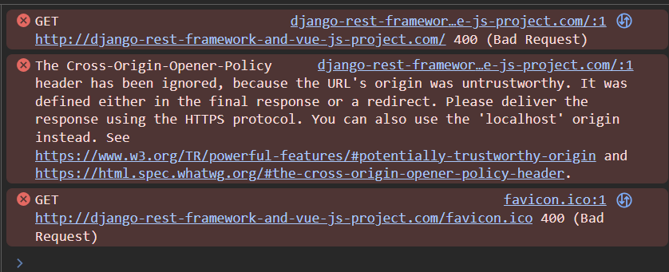

# Deploy Django REST Framework and Vue JS together with Apache Web Server

- [Setup SSH Config for Multiple Users](https://github.com/satyam-seth-learnings/devops-learning/blob/main/61.setup-ssh-config-for-multiple-users.md)

- [Deploy Django Project with Apache Web Server via GitHub](https://github.com/satyam-seth-learnings/devops-learning/tree/main/41.deploy-django-project-with-apache-web-server-via-github)

    - Note:

        - We need to set A and AAAA records for api sub-domain.

        - if multiple ssh keys exists then we can give custom name to our new ssh key.

            - To generate ssh keys

                ```sh
                ssh-keygen -f /home/try-nginx/.ssh/drf_ed25519 -t ed25519 -C "drfgithub"
                ```

            - To use ssh keys

                ```sh
                GIT_SSH_COMMAND="ssh -i ~/.ssh/drf_ed25519" git clone git@github.com:satyam-seth-learnings/deploy-django-rest-framework-and-vue-js-project-together-with-apache-web-server-deploy.git
                ```
        
        - We need to update following code in virtual host file

            ```xml
            ServerName www.backend.django-rest-framework-and-vue-js-project.com
            ServerAlias backend.django-rest-framework-and-vue-js-project.com 
            ```

        - If unable to install packages in virtual environment

            -  Check Permissions of the .venv Directory

                ```sh
                ls -ld /var/www/django-rest-framework-and-vue-js-project/backend/.venv
                ```

            - Change Ownership

                ```sh
                sudo chown -R $(whoami):$(whoami) /var/www/django-rest-framework-and-vue-js-project/backend/.venv
                ```

- [Deploy Vue JS Project with Apache Web Server via GitHub](https://github.com/satyam-seth-learnings/devops-learning/tree/main/51.deploy-vue-js-project-with-apache-web-server-via-github)

    - Note:

        - if multiple ssh keys exists then we can give custom name to our new ssh key.

            - To generate ssh keys

                ```sh
                ssh-keygen -f /home/try-nginx/.ssh/vue_ed25519 -t ed25519 -C "vuegithub"
                ```

            - To use ssh keys

                ```sh
                GIT_SSH_COMMAND="ssh -i ~/.ssh/vue_ed25519" git clone git@github.com:satyam-seth-learnings/deploy-django-rest-framework-and-vue-js-project-together-with-apache-web-server-deploy.git
                ```

# Reference Links 

- [YouTube Video Link](https://youtu.be/w35ovhbLEPg?si=cSCZ7kAOS8KlSKiG)

- [Backend Github Link](https://github.com/geekyshow1/GeekyShowsNotes/blob/main/Deploy_Django_Apache_Github.md)

- [Frontend Github Link](https://github.com/geekyshow1/GeekyShowsNotes/blob/main/Deploy_React_Vue_Next_Nuxt_Apache_Github.md)

# Pending Fix Issue

- Need to use https instead of http otherwise, The Cross-Origin-Opener-Policy header has been ignored, because the URL's origin was untrustworthy. It was defined either in the final response or a redirect. Please deliver the response using the HTTPS protocol. You can also use the 'localhost' origin instead. See https://www.w3.org/TR/powerful-features/#potentially-trustworthy-origin and https://html.spec.whatwg.org/#the-cross-origin-opener-policy-header.

